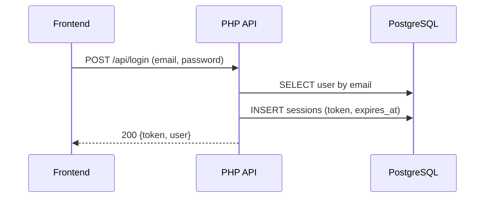
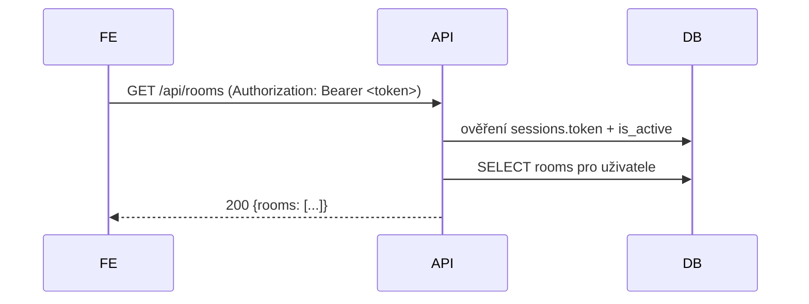
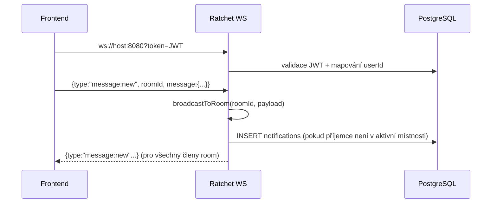

# Architektura systému

## Kontext
Whisp je 3‑vrstvá aplikace:

- **React frontend** (UI + stav aplikace + integrace REST/WS)
- **PHP backend API** (autentizace, správa uživatelů, přátel, místností, zpráv, admin)
- **WebSocket server (Ratchet)** (realtime zprávy, presence, notifikace, update eventy)
- **PostgreSQL** jako jednotný zdroj pravdy (users, sessions, rooms, messages, friendships, notifications, activity_logs)

## Komponenty

```mermaid
flowchart LR
  FE[Frontend (React/Vite)\n:5173] -->|REST JSON| API[Backend API (PHP)\n:8000]
  FE -->|WebSocket| WS[WebSocket (Ratchet)\n:8080]
  API -->|PDO| DB[(PostgreSQL)\n:5432]
  WS -->|PDO| DB
```

### Frontend
- Entrypoint: `frontend/src/main.jsx`
- Aplikace: `frontend/src/App.jsx`
- Globální auth + API klient: `frontend/src/Context/AuthContext.jsx`
- UI moduly: `frontend/src/Components/*`

Frontend komunikuje:
- přes REST s API (`axios` instance s `baseURL http://<host>:8000/api`)
- přes WS s Ratchet (`ws://<host>:8080?token=<JWT>`)

### Backend (REST API)
- Entrypoint: `backend/public/index.php`
- Router: `backend/src/Router.php`
- Controllers: `backend/src/Controllers/*`
- Models (PDO): `backend/src/Models/*`
- Middleware: `backend/src/Middleware/AuthMiddleware.php`
- Services: `backend/src/Services/JWTService.php`
- DB config: `backend/src/Config/Database.php`

### Realtime (Ratchet)
- Start skript: `backend/bin/server.php`
- Handler: `backend/src/Sockets/ChatSocket.php`
- Autentizace: JWT token v query param `token`, dekódování přes `JWTService::decode()`.

## Hlavní runtime toky

### 1) Přihlášení (REST)


### 2) Načtení místností (REST)


### 3) Realtime zpráva (WS)


## Vrstvy a odpovědnosti (aktuální stav)
- Router dělá routing + část CORS (v kombinaci s `public/index.php`).
- Controllers dělají validaci vstupů a v některých případech i přímé SQL (viz audit v `issue.md`).
- Modely zapouzdřují většinu DB operací pro chat a uživatele.
- Middleware `AuthMiddleware` řeší ověření JWT a validaci tokenu proti tabulce `sessions`.

## Dopady pro budoucí vývoj
- Pro produkční nasazení je vhodné sjednotit CORS, přesunout JWT secret do ENV, doplnit rate limiting a zavést jednotný error kontrakt.
- Pro škálování WS (více instancí) bude potřeba pub/sub (Redis) nebo message broker; současný broadcast je in‑memory.
